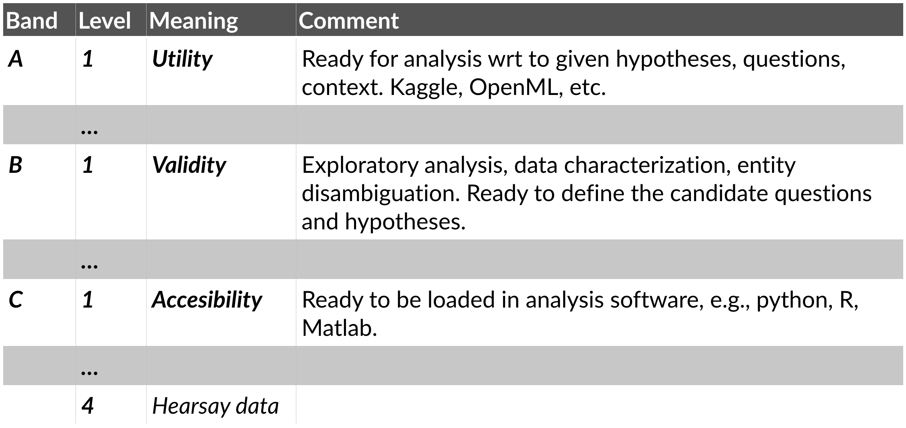

# Data Readiness Levels

The notion of [Data Readiness Levels](http://data-readiness.org/) (DRL), introduced by Lawrence 
([2017](https://arxiv.org/abs/1705.02245)), provides a way of 
talking about data much in the same way [Technology Readiness Levels](https://en.wikipedia.org/wiki/Technology_readiness_level) facilitate 
communication regarding the maturity of technology. As such, it is a framework suitable for
exchanging information with stakeholders regarding data **accessibility**, **validity**, and **utility**.

The table below illustrates the three different major Bands of the DRLs. Each band can be thought of as consisting of multiple
levels. At the lowest level, i.e., Band C - Level 4, someone has heard that there is data to be had. This "hearsay" level is
often where a new project starts — someone knows that there should be data available to work with. Since the access
to data often dictates the bounds of possible analysis, and thus the level of results attainable, walking a new project
or stakeholder through the DRLs is not only a nice-to-have, it is a must-do. If there is no data to work with, it does
not matter what kind of algorithms are available.

## Band C

**Band C** concerns the **accessibility** of data. All work at this level serves to grant the team 
intended to work with the data access to it. Issues that fall under Band C include:
 *  **Does the data exist?**. Is the data required to address the task even recorded?
 *  **Data conversion and encoding**. One of the major challenges faced within NLP is the conversion of
documents from a source format, e.g., PDF, Word or Excel, to a format suitable for addressing the task at hand. 
In order to move beyond Band C, data conversion and encoding have to be in place.
  * **Legal aspects of accessibility**. Not only should the data be available to the intended team, but the team and the
  result of their efforts to produce a solution to the task at hand should also be cleared with respect to the legal aspects
  of accessing, and handling of the data. This include, e.g., the handling of personal identifiable information.
 * **Programmatic aspects of accessiblity**. The team should have easy access to the data, by a method of their choice, 
  e.g., via an API, or a database interface.

## Band B

**Band B** concerns the **validity** of data. In order to pass Band B, the data has to be valid in the sense that it is
**representative** of the task at hand. Furthermore, the data should be **deduplicated**, **noise** should be identified, 
**missing values** should be characterized, etc. At this stage, the data should be suitable for exploratory analysis, and the 
forming of working hypotheses.

## Band A

**Band A** concerns the **utility** of data. The utility of the data concerns the way in which the data is intended to be
used: Is the data enough to solve the task at hand?

A project should strive for data readiness at Band A - Level 1. Note that the Data Readiness Levels should be interpreted with respect to a given task. Data that is at Band A for a Task X might be considered Band B for a Task Y, simply because the requirements on the data are different in the two tasks. For Task A it could be enough if the data is clean and representative of the domain, while for Task Y it could need to be annotated with the appropriate information.
